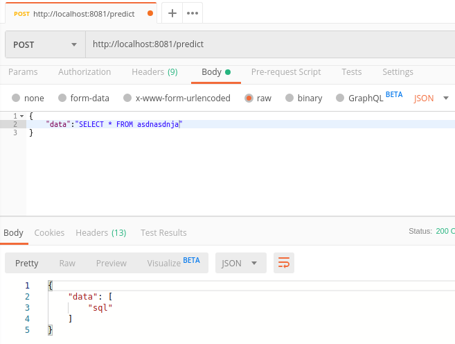
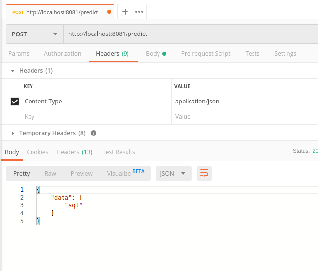

# Payload Identifier

**When developing Web Applications, we cannot trust on users input data.**

With that in mind, some developers try to implement themselves the logic to prevent some commomn attacks
such as **SQLinjection, Cross Site Scripting, etc**.

Some applications uses WAF (Web Application Firewall) wich is a rule based payload identification.

There are several strategies for blacklist evasion (aka. WAF) used by hackers.

Using Payload Identifier, even enconding can be detected as malicious payload.

# How does it works ?

Payload identifier is a Rest API for malicious payload validation using machine learning.

It doesn't use a blacklist/whitelist approach.

Powered by machine learning, it predicts whether there's malicious payloads.

# Examples

## Request

    POST /predict
    Content-type: application/json

    {
        "data": ""
    }

## Response

    {
        "data":"Xss"
    }

The payload is probably a XSS attack.

# Using with Python requests module

# Using Postman

